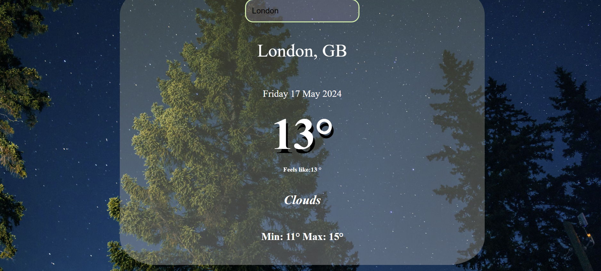

# weather-dashboard
Real-Time Weather Dashboard that provides users with current weather conditions for any city worldwide. Leveraging the OpenWeatherMap API, this application allows users to enter a city name and instantly receive detailed weather data, including temperature, feels-like temperature, weather conditions, and temperature variations throughout the day. The focus of this project was to deepen my understanding of API integration in JavaScript and enhance my skills in handling asynchronous data retrieval and updating the UI dynamically based on user input.

### Before running the project, you need to get your own API key from OpenWeatherMap.

## Features:
* City-Based Weather Information
* Real-Time Data Retrieval
* Dynamic Date Handling
* Responsive Design

## Learning Outcomes:
* API Integration: Learned how to make HTTP requests to an API to fetch data and handle responses asynchronously using JavaScript.
* Dynamic UI Updates: Enhanced skills in manipulating the DOM to update the user interface dynamically based on the data received from the API.
* Event Handling: Gained deeper insights into JavaScript event handling, particularly handling the 'Enter' key event for search functionality.
* Date Manipulation: Demonstrated the ability to work with JavaScript’s Date object to display the current date, which updates dynamically each time the application is accessed.

## Technologies Used:
* HTML for structure
* CSS for styling
* JavaScript for logic, API calls, and DOM manipulations

## Link to the app:
https://get-the-weather-report.glitch.me/